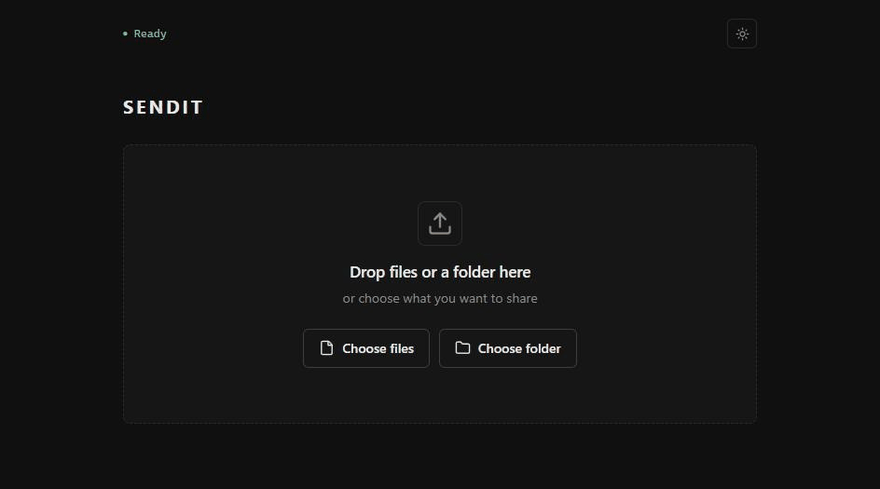

# SendIt

Temporary file sharing from a Windows PC. Files stream from the sender's browser while the recipient downloads. The link dies with the process.

The browser interface is built with [VRUI](https://github.com/vaakx-dev/vrui), another one of my projects.



## Requirements

- Windows 10 or 11
- Node.js 22 or newer

The first public run downloads `cloudflared` into `%LOCALAPPDATA%\sendit\bin`.

## Install

```powershell
npm install
npm run build
npm install --global .
```

## Use

```powershell
sendit
```

Select files or a folder on the control page, create the link, and keep the window open until the download finishes. `Ctrl+C` stops sharing.

## Uninstall

```powershell
sendit --uninstall                    # removes the cloudflared helper and SendIt data
npm uninstall --global sendit-local   # removes the sendit command
```

## Development

```powershell
npm run dev   # build and run locally, no public tunnel
npm test      # build and run the checks
```

## How it works

```text
sender browser -> local SendIt process -> Cloudflare Quick Tunnel -> recipient browser
```

Chunks stream one at a time with backpressure. Folder downloads are zipped as they stream, never staged on disk.

## Security

- The control page requires a random key and is served only on localhost.
- Share links carry a random 192-bit token and die with the process.
- Only explicitly selected files are served; there is no file-system browsing API.
- Traffic passes through Cloudflare. Add encryption before sharing sensitive files.
